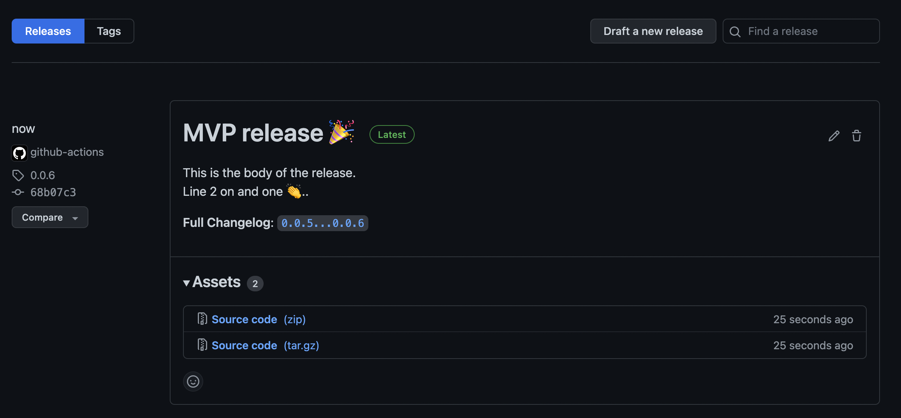

# action-release

[](https://img.shields.io/github/v/release/mateothegreat/action-release?color=%233D9970)

GitHub action to auto-magically perform semantic version bumps and create releases.

* Doesn't use some hacky `git` subshell commands (straight to the REST API baby!) 👏👏👏
* Creates a new tag off of specified branch using semantic versioning.
* Creates a new release based on new tag with notes.



## Inputs

* `owner` __(required)__ - string - The owner of your repository (username or organization name).
* `repo` __(required)__ - string - The name of your repository.
* `increment` __(required)__ - string - Increment based on major, minor, or release.
* `default` (optional) - string - The default tag if there are no tags (defaults to 0.0.0).
* `prefix` (optional) - string - Prefix to add to the semantic version value (defaults to none).
* `branch` (optional) - string - Branch to base tag off of (defaults to main).
* `release_name` (optional) - string - Name of the release (defaults to the new version).
* `release_body` (optional) - string - Body of the release.
* `release_notes` (optional) - boolean - Automatically generate release notes for the release (it will be appended to
* `committer_name` (optional) - string - Name of the committer.
* `committer_email` (optional) - string - Email of the committer.

## Outputs

* `current_version` - string - Current (previous) version (i.e.: 0.0.1).
* `next_version` - string - Next (applied) version (i.e.: 0.0.2).

## Usage

### Minimal example

```yaml
name: release
on:
  push:
    branches:
      - main

#
# Required to be able to call the REST API to create both the
# new tag and release.
#
permissions:
  contents: write

jobs:
  release:
    name: Perform a semantic release
    runs-on: ubuntu-latest
    steps:
      - name: action-release
        uses: mateothegreat/action-release@main
        with:
          github_token: ${{ secrets.GITHUB_TOKEN }}
          owner: youreawesome
          repo: nuts-and-bolts
          increment: patch
          committer_name: Matthew Davis
          committer_email: matthew@matthewdavis.io
```

### Full example

```yaml
name: release
on:
  push:
    branches:
      - main

#
# Required to be able to call the REST API to create both the
# new tag and release.
#
permissions:
  contents: write

jobs:
  release:
    name: Perform a semantic release
    runs-on: ubuntu-latest
    steps:
      - name: action-release
        uses: mateothegreat/action-release@main
        with:
          github_token: ${{ secrets.GITHUB_TOKEN }}
          owner: youreawesome
          repo: nuts-and-bolts
          increment: patch
          default: v0.0.0
          prefix: v
          branch: main
          release_name: MVP release 🎉
          release_body: |
            This is the body of the release.
            Line 2 on and one 👏..
          release_notes: true
          committer_name: Matthew Davis
          committer_email: matthew@matthewdavis.io
      - name: Print the current and next version using outputs
        uses: actions/checkout@v2
        with:
          owner: mateothegreat
          repo: action-release
          current_version: ${{ steps.release.outputs.current_version }}
          next_version: ${{ steps.release.outputs.next_version }}
```
